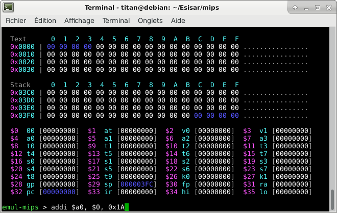

# mips-emulator

An emulator written in C for educational purposes.

First engineering school project (still amateur in 2021).

## To build

```sh
make
make all
```

## To run

### Simple mode

```sh
./mips ./tests/test5.txt
./mips ./tests/test6.txt
```


### Compilation errors

```sh
./mips ./tests/test3.txt
```


### Step by step

```sh
./mips ./tests/test6.txt -step
```


### Interactive

```sh
./mips
# addi $a0, $0, 0x1A
# exit
```



## To clean

```sh
make clean    # .o
make cleanall # .o and .d
make mrproper # .o .d and binary
```
